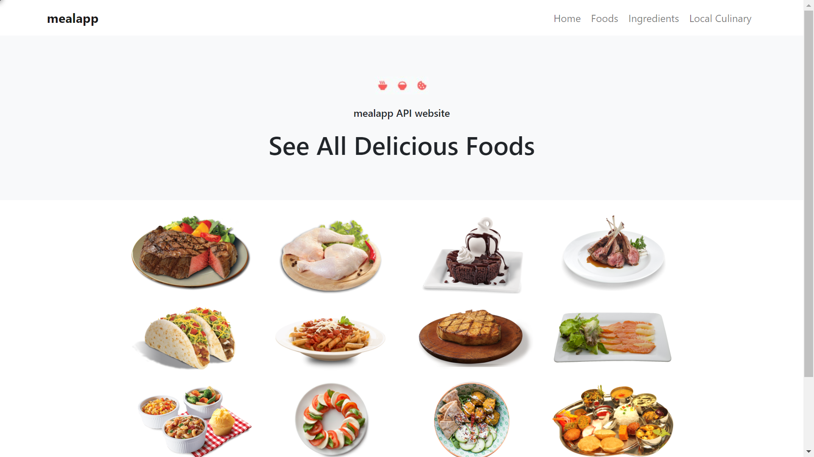
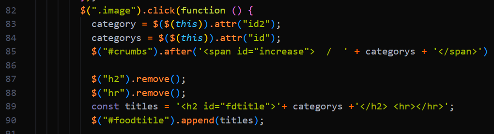

<!-- TABLE OF CONTENTS -->

  
Table of Contents

  <ol>
    <li>
      <a href="#about-the-project">About The Project</a>
      <ul>
        <li><a href="#built-with">Built With</a></li>
      </ul>
    </li>
    <li>
      <a href="#getting-started">Getting Started</a>
      <ul>
        <li><a href="#prerequisites">Prerequisites</a></li>
        <li><a href="#installation">Installation</a></li>
      </ul>
    </li>
    <li><a href="#usage">Usage</a></li>
    <li><a href="#roadmap">Roadmap</a></li>
    <li><a href="#contributing">Contributing</a></li>
    <li><a href="#license">License</a></li>
    <li><a href="#contact">Contact</a></li>
    <li><a href="#acknowledgments">Acknowledgments</a></li>
  </ol>

<!-- ABOUT THE PROJECT -->
## About The Project

This project is a Pre-Assessment from CM Labs. In this project we have to create a page that can display data from the given EndPoint

(<a href="#top">back to top</a>)

### Built With

* [![HTML][HTML]][HTML-url]
* [![CSS][CSS]][CSS-url]
* [![Bootstrap][Bootstrap]][Bootstrap-url]
* [![Javascript][Javascript]][Javascript-url]
* [![JQuerry][JQuerry]][Jquerry-url]
* [![AJAX][AJAX]][AJAX-url]

(<a href="#top">back to top</a>)

<!-- GETTING STARTED -->
## Getting Started
To start the project, put the project folder into the localhost laptop and turn on the local server. After that open the HTML project via the localhost server link. If you don't use the localhost server, you can download the extension on the visual studio code, namely the live server. Then open the html file and press f1 then search live server in the search field and click. Then the web will automatically open in a local-based web server.

### Prerequisites
* Browser
* Local Server
* Text Editor

(<a href="#top">back to top</a>)

<!-- USAGE EXAMPLES -->
## Usage
This website has 3 main pages, namely Category, Food, and FoodDetail. This web can move to another page without having to move pages. This website replaces its component-based page. It's not HTML that moves, but components in the web that move around

Code Example:

For example in the code above, if the image is clicked it will delete h2, hrm and titles into #foodtitle. This shows us that the variable component

(<a href="#top">back to top</a>)

<!-- CONTACT -->
## Contact

Samuel Jofanisrel Pangaribuan - [@samuel_jofanisrel](instagram.com/samuel_jofanisrel) - samuel.pangaribuan@student.president.ac.id

Project Link: [https://github.com/sammm81/cmlabs-frontend-internship-test](https://github.com/sammm81/cmlabs-frontend-internship-test)

[Javascript-url]: https://www.javascript.com/
[Javascript]: https://img.shields.io/badge/-Javascript-yellow

[HTML-url]: https://developer.mozilla.org/en-US/docs/Web/HTML
[HTML]: https://img.shields.io/badge/-HTML-brightgreen

[CSS-url]: https://www.w3.org/Style/CSS/Overview.en.html
[CSS]: https://img.shields.io/badge/-CSS-blue

[JQuerry-url]: https://jquery.com/
[JQuerry]: https://img.shields.io/badge/-JQuerry-red

[AJAX-url]: https://api.jquery.com/Jquery.ajax/
[AJAX]: https://img.shields.io/badge/-ajax-yellowgreen

[Bootstrap-url]: https://getbootstrap.com/
[Bootstrap]: https://img.shields.io/badge/-Bootstrap-blue

